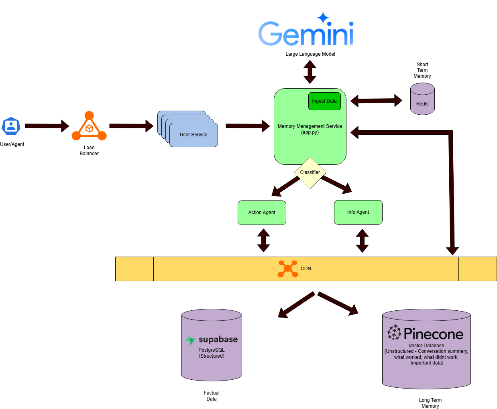
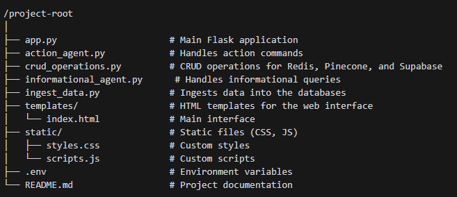

# Elephanta: A Multi-Faceted RAG Chatbot with Advanced Memory Management and CRUD Capabilities
## Overview

This project implements a chatbot system that handles informational queries and action commands. The chatbot utilizes Google Gemini for natural language processing and integrates with Redis, Pinecone, and Supabase for data storage and retrieval.

## System Design and Architecture



### Components

1. **Flask Web Application**: The main application that handles user interactions and routes requests to the appropriate handlers.
2. **Google Gemini**: Used for natural language processing, including classifying user input and generating responses.
3. **Redis**: A fast in-memory data store used for storing user session data and conversation history.
4. **Pinecone**: A vector database used for storing and querying embeddings of user inputs and facts.
5. **Supabase**: A backend-as-a-service platform that provides a PostgreSQL database for storing structured data, such as user facts.

### Architecture

- **User Input**: The user interacts with the chatbot through a web interface.
- **Classification**: User input is classified as either "informational" or "action_command" using the Gemini model.
- **Informational Handling**: If classified as informational, the input is processed to retrieve relevant facts and generate a response.
- **Action Handling**: If classified as an action command, the input is parsed to determine the intended action (e.g., delete a fact) and the corresponding CRUD operations are performed on the databases.
- **Data Storage**: User data, facts, and embeddings are stored in Redis, Pinecone, and Supabase as needed.

## Project Structure



## Requirements

- Python 3.x
- Flask
- Redis
- Pinecone
- Supabase
- Google Generative AI SDK
- dotenv

## Installation

1. **Clone the Repository**:
   ```bash
   git clone <repository-url>
   cd <repository-directory>
   ```

2. **Create a Virtual Environment**:
   ```bash
   python -m venv venv
   source venv/bin/activate  # On Windows use `venv\Scripts\activate`
   ```

3. **Install Dependencies**:
   ```bash
   pip install -r requirements.txt
   ```

4. **Set Up Environment Variables**:
   Create a `.env` file in the project root and add the following variables:
   ```plaintext
   GEMINI_API_KEY=your_gemini_api_key
   PINECONE_API_KEY=your_pinecone_api_key
   PINECONE_INDEX_NAME=your_pinecone_index_name
   SUPABASE_URL=your_supabase_url
   SUPABASE_KEY=your_supabase_key
   ```

## Running the Project

1. **Ingest Initial Data**:
   Run the `ingest_data.py` script to populate the databases with initial data.
   ```bash
   python ingest_data.py
   ```

2. **Start the Flask Application**:
   ```bash
   python app.py
   ```

3. **Access the Chatbot**:
   Open your web browser and navigate to `http://localhost:5000` to interact with the chatbot.

## Usage

- **Informational Queries**: Ask the chatbot questions to retrieve information or facts.
- **Action Commands**: Use commands like "forget everything" or "delete fact XYZ" to perform actions on the stored data.

## Contributing

Contributions are welcome! Please open an issue or submit a pull request for any improvements or bug fixes.

## License

This project is licensed under the MIT License. See the LICENSE file for details.
